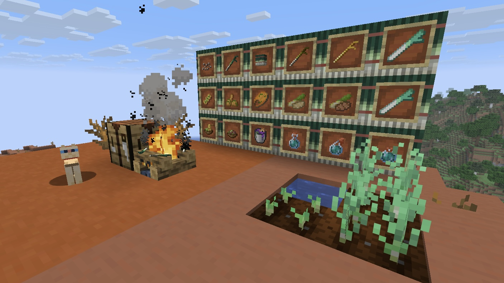

繁體中文 | [简体中文](README.zh_cn.md) | [日本語](README.ja_jp.md) | [English](README.en_us.md)

# 概要：
《初音的蔥料理》是以「初音未來」與「蔥」為主題發想的料理模組。
使用原版為主的內容作為延伸，加入了一系列與「蔥」相關的作物、料理、武器、藥水、效果⋯⋯，當然也少不了各式小彩蛋！

# 預覽：

# 常見問題：
問：會移植到其他版本嗎？
答：1.0.0正式版會移植到NeoForge 26.1.2、1.21.1，其餘目前沒有計畫。

問：遇到錯誤如何解決？
答：請至Github提交Issues，並提供錯誤訊息或詳細描述。

問：能如何使用這個模組？
答：代碼採用LGPL-3.0開源協議授權。
除了指定畫作為原作者保有所有權外，美術與模型資源採用CC BY-NC-SA 4.0授權。
初音未來角色相關二次創作內容，依據[ピアプロ・キャラクター・ライセンス(PCL)](https://piapro.jp/license/pcl/summary)，以非營利、無償為目的發布。

